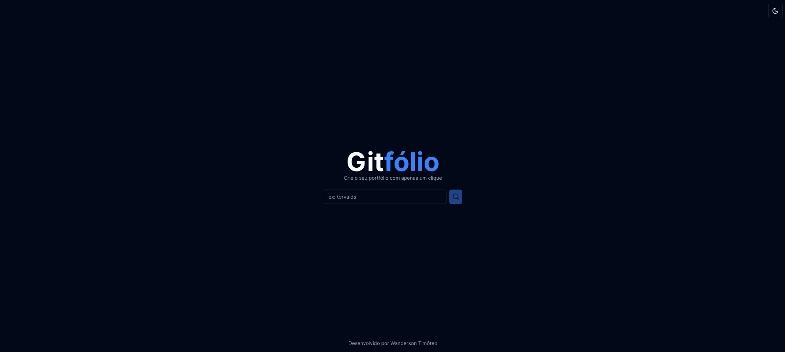
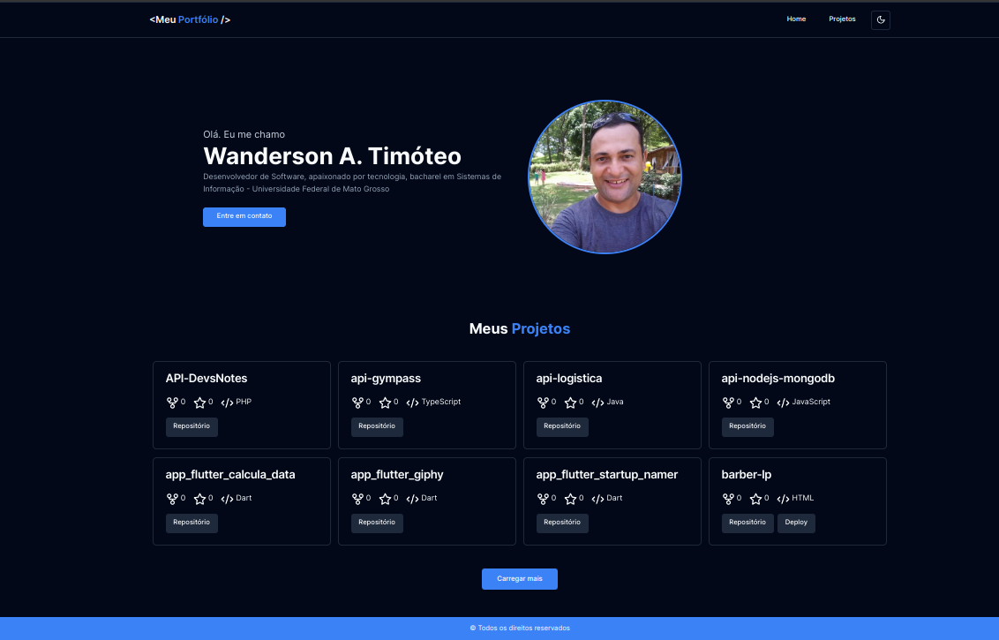
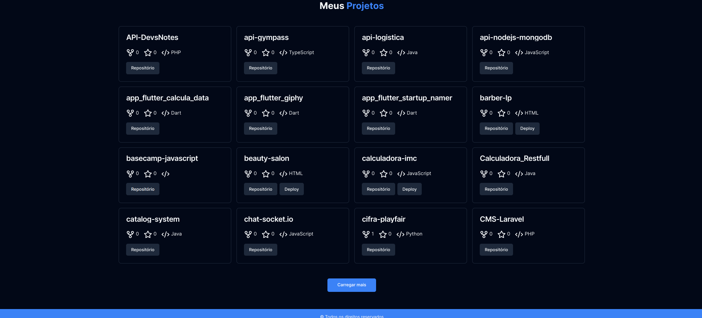

<h1 align="center">
  Gitfólio  
</h1>

<div align="center">
  <a href="#-projeto">Projeto</a>&nbsp;&nbsp;&nbsp;|&nbsp;&nbsp;&nbsp;
  <a href="#-tecnologias">Tecnologias</a>&nbsp;&nbsp;&nbsp;|&nbsp;&nbsp;&nbsp;
  <a href="#-licença">Licença</a>&nbsp;&nbsp;&nbsp;
</div>

<br>

<p align="center">
  
  
  
</p>

<br>

## 💻 Projeto

Aplicação busca através do nome do usuário do github e cria um portfolio, baseado nas informações deste usuário mostrando seus projetos.
<br>

### GitFolio Home Page de Busca

<p align="center">
    
</p>
<br>

### GitFolio Home

<p align="center">
    
</p>

<br>

### Gitfolio Projetos

<p align="center">
    
</p>
<br>

## 🚀 Tecnologias

Esse projeto foi desenvolvido com as seguintes tecnologias e ferramentas:

<div align="center">
  
  
  
  
  
  
  
 
</div>

<br>

## 🔥 Executar Aplicação

### 🎇 Executando Localmente a Aplicação

Caso você deseja executar o projeto na sua máquina local, você precisará instalar o Node.js 18.\* em sua máquina. Após a instalação, basta seguir os passos abaixo:

### 🌀 Começando...

Para começar, você deve simplesmente clonar o repositório do projeto na sua máquina.

Navegue até o local onde você clonou o projeto, exemplo:

```sh
C:\Users\NomeDoComputador\Documents\CloneDoProjeto
```

#### ❗️ Instalando as Dependências (via Windows):

Bom, agora que clonou o projeto **(dentro da pasta `gitfolio`)** contém todo o projeto desenvolvido em React.js com Next.js e Typescript e TailwindCSS.

Agora abra um CMD ou terminal ou prompt de comando e acesse a aplicação e digite a seguinte instrução:

```sh
npm install
```

ou

```sh
yarn install
```

Ao digitar a instrução acima, automaticamente ele irá baixar todas as dependências listadas e definidas no arquivo package.json:

- `node_modules` - que contêm os packages do npm que precisará para o projeto.

<br>

### 🛰️ Executando o projeto

Após baixar todas as dependências é só digitar no terminal a instrução abaixo:

Para executar o projeto na sua máquina local:

```sh
npm run dev
```

ou

```sh
yarn dev
```

Pronto! dessa forma o projeto `gitfolio` estará rodando localmente em sua maquina. Acesse no navegador o endereço abaixo:

**Projeto Web**

```sh
http://localhost:3000
```

<br>

## 🚩 Tenho Dúvidas... O que fazer?

Caso tenha dúvidas sobre o código do projeto, sintam-se a vontade em abrir uma **[ISSUE AQUI](https://github.com/Wanderson-A-Timoteo/gitfolio)**. Assim que possível, responderei todas as dúvidas!

<br>

## 💡 Licença

Esse projeto está sob a licença MIT. Veja o arquivo [LICENSE](.github/LICENSE.md) para mais detalhes.

<br>

## 🤝 Agradecimentos

Projeto idealizado por [Wllysses Tavares](https://github.com/wllysses).
